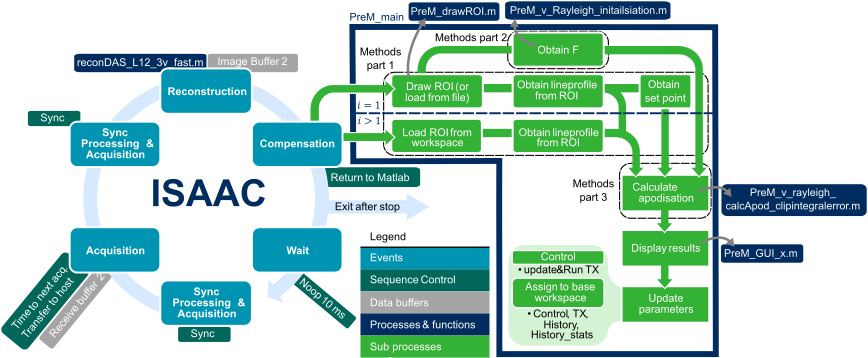

# ISAAC: Iterative Scheme for Active Attenuation Correction

This repository contains the code for ISAAC as described in: _Imaging Behind the Plaque: Improved Blood Flow Quantification Using an Iterative Scheme for Active Attenuation Correction_, Ultrasound in Medicine and Biology, J. Plomp, A. Ghanbarzadeh-Dagheyan, M. Versluis, G. Lajoinie and E. Groot Jebbink. DOI: [10.1016/j.ultrasmedbio.2025.02.012](https://doi.org/10.1016/j.ultrasmedbio.2025.02.012).

The schematic below describes the iterative scheme. All mentioned functions (in dark blue) can be found in [A_Acquisition/ExternalProcessing](A_Acquisition/ExternalProcessing), except for [reconDAS_L12_3v_fast.m](delay-and-sum-reconstruction/reconDAS_L12_3v_fast.m).

Folders:
* [A_Acquisition](A_Acquisition) contains the ISAAC algorithm and functions to save the data. It can be run using the [step1_MAIN_acquisition_HFR_L12_3v.m](A_Acquisition/step1_MAIN_acquisition_HFR_L12_3v.m).
* [B_Reconstruction (DAS) of HFR data](<B_Reconstruction (DAS) of HFR data>) contains code to (batch) reconstruct the RF data saved during high-frame-rate (HFR) recordings.
* [C_Load_reconstruced_HFRData](C_Load_reconstruced_HFRData) contains example code to load the saved HFR data for further analysis.
    * Additionally, the folder [ImageEnhancement_Cheung](C_Load_reconstruced_HFRData/ImageEnhancement_Cheung) contains a reimplementation of the methods described by [Cheung et al (2015)](https://doi.org/10.1016/J.ULTRASMEDBIO.2015.02.010) in _Attenuation Correction and Normalisation for Quantification of Constrast Enhancement in Ultrasound Images of Carotid Arteries_. 
* [delay-and-sum-reconstruction]() contains functions used in reconstruction (used both during [Acquisition](A_Acquisition) and [in offline reconstruction](<B_Reconstruction (DAS) of HFR data>)).
* [make-video-isaac](make-video-isaac) contains code to make a video of the iterative procedure. See below.
  
## Making a video of the iterative procedure
[make-video-isaac](make-video-isaac) contains the code to convert the data stored in the info_PreM.m and PreM_ImageData.bin files (see [example data](data_examples/Data)) to a video showing the progress of for example the image intensity and apodisation during the iterative procedure. It will be stored in the same folder as the data.
## Methods to be downloaded externally 
Store the methods mentioned below in [delay-and-sum-reconstruction](delay-and-sum-reconstruction)
* _rf2iq.m_ can be downloaded as part of 
the [MUST toolbox](https://www.biomecardio.com/MUST/index.html).
* _svdecon.m_ by Vipin Vijayan (2014) can be downloaded from [Mathworks](https://viewer.mathworks.com/?viewer=plain_code&url=https%3A%2F%2Fwww.mathworks.com%2Fmatlabcentral%2Fmlc-downloads%2Fdownloads%2Fsubmissions%2F47132%2Fversions%2F4%2Fcontents%2Fsvdecon.m&embed=web)
    or else it can be replaced with MATLABs svd(x,'econ') which does the same but slower.
## Versions
For acquiring the data for the paper, the acquisition code was ran using Verasonics Vantage 4.7.6. So far, no issues have been encountered with older versions.

The iterative scheme was ran (see [step1_MAIN_acquisition_HFR_L12_3v.m](A_Acquisition/step1_MAIN_acquisition_HFR_L12_3v.m)) on the Verasonics Vantage 256 in MATLAB 2021b. Most of the offline data processing has been done in MATLAB 2023b. In [B_Reconstruction (DAS) of HFR data](<B_Reconstruction (DAS) of HFR data>), the [clim](https://nl.mathworks.com/help/matlab/ref/clim.html) function is used, which replaces caxis from MATLAB 2022a onwards. Other than that no issues have been encountered with older MATLAB versions. 

## Safety
So far, the algorithm has solely been tested in _in vitro_ experiments and safety studies have not been performed. See [LICENSE](LICENSE.txt) with regards to liability.